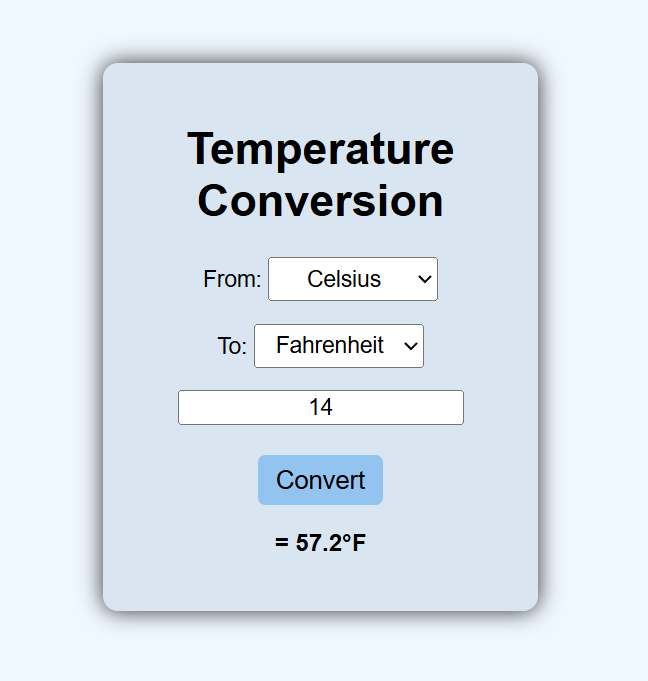

# Temperature Conversion

I have created a basic **Temperature Conversion** project. The goal of this project was to practice **HTML structure**, **CSS styling**, **responsive design**, and **JavaScript DOM manipulation** by building a small, functional frontend application.

## Features
- Convert temperatures between Celsius and Fahrenheit  
- Simple and clean user interface  
- Responsive layout that works on mobile and desktop  

## Screenshot

## Technologies Used
- HTML
- CSS (Flexbox, Media Queries)
- JavaScript

## Live Demo
[View Website](https://maher-wahid.github.io/temperature-conversion/)